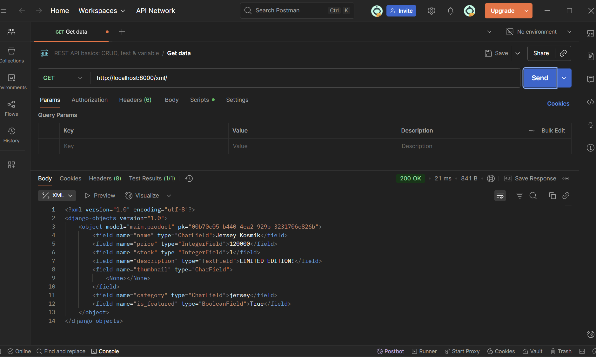
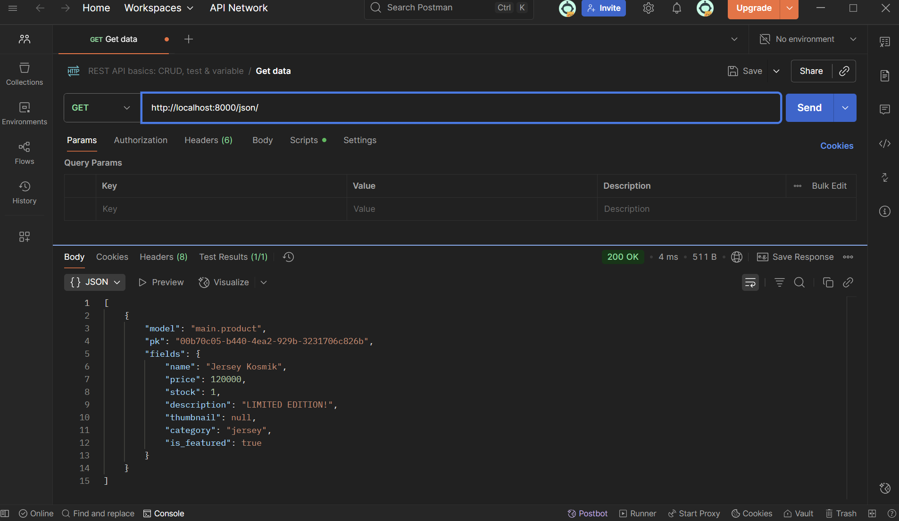
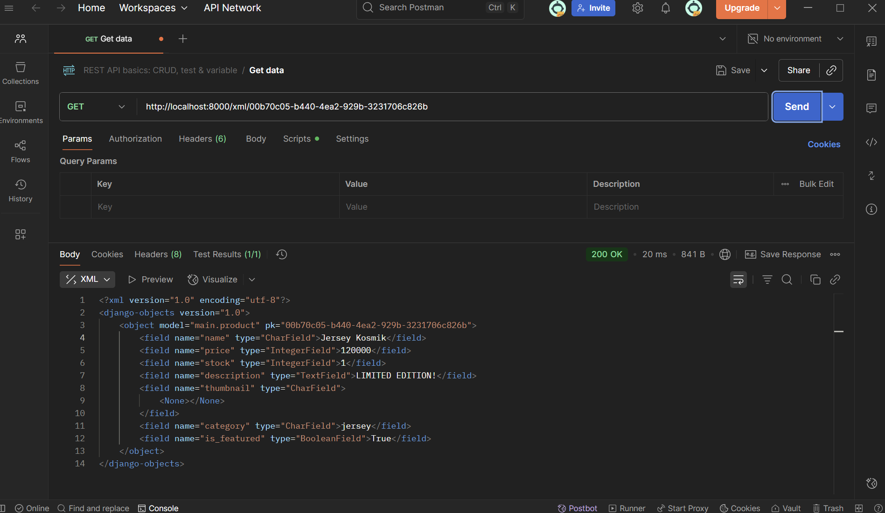
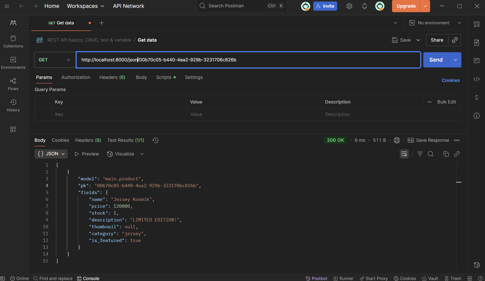

Nama : Azzahra Anjelika Borselano

NPM : 2406419663

Kelas : PBP B

Link aplikasi : https://azzahra-anjelika-kusepak.pbp.cs.ui.ac.id/

1. Jelaskan mengapa kita memerlukan data delivery dalam pengimplementasian sebuah platform?
- Data delivery penting karena web pada dasarnya bekerja dengan pola komunikasi antara client dan server lewat HTTP request dan response. Setiap interaksi di web terjadi melalui proses data delivery. Tanpa data delivery yang terstruktur, platform tidak bisa menyajikan informasi dengan konsisten. Dengan adanya mekanisme data delivery, pengguna tetap bisa berinteraksi walaupun data sedang dimuat di belakang layar.

2. Menurutmu, mana yang lebih baik antara XML dan JSON? Mengapa JSON lebih populer dibandingkan XML?
- Menurut saya, JSON lebih baik untuk dipakai saat ini, karena lebih ringkas dan mudah dibaca. Dengan XML, kita perlu ambil dokumen, lalu menggunakan XML DOM untuk loop isi dari dokumen tersebut dan ekstrak nilainya. Sedangkan dengan JSON, kita cukup ambil string lalu melakukan parse dengan JSON.parse(). Karena alasan ini juga, JSON lebih populer dibanding XML karena parsingnya lebih cepat, sintaks lebih ringkas, dan secara umum lebih mudah digunakan dibanding XML.

3. Jelaskan fungsi dari method is_valid() pada form Django dan mengapa kita membutuhkan method tersebut?
- Fungsi dari method tersebut adalah untuk mengecek apakah semua field pada form sudah benar terisi atau belum, sesuai dengan ketentuannya (seperti CharField, IntegerField) atau tidak dan mengecek validator tambahan seperti MinValueValidator(). Jika ada field yang tidak terisi dengan benar, method ini akan mengembalikan invalid.

4. Mengapa kita membutuhkan csrf_token saat membuat form di Django? Apa yang dapat terjadi jika kita tidak menambahkan csrf_token pada form Django? Bagaimana hal tersebut dapat dimanfaatkan oleh penyerang?
- csrf_token pada Django berfungsi sebagai tanda pengaman setiap kali pengguna mengirimkan data melalui form. Token ini berupa kode acak yang dibuat khusus untuk setiap sesi atau setiap form, lalu harus sesuai dengan yang dimiliki server. Dengan begitu, hanya form asli dari situs yang bisa diterima. Jika token ini tidak digunakan, form bisa dipalsukan dari situs luar.

5. Jelaskan bagaimana cara kamu mengimplementasikan checklist di atas secara step-by-step (bukan hanya sekadar mengikuti tutorial).
- Pertama-tama, saya membuat halaman yang menampilkan data objek model terlebih dahulu. Halaman ini memiliki tombol "Add Product" untuk redirect ke halaman form dan tombol "View Product" untuk melihat detail objek. Saya melakukan ini dengan membuat perubahan pada berkas main.html.
- Membuat halaman form untuk menambahkan objek model dengan field-field yang sesuai dengan atribut objek Product.
- Membuat beberapa perubahan pada konstruksi objek Product di berkas models.py, yaitu menambahkan list CATEGORY_CHOICES yang dapat dipilih ketika mengisi field category nantinya, juga memberi MinValueValidator untuk field stok dan harga agar valuenya > 0.
- Karena terdapat modifikasi pada models, saya melakukan migrasi agar database up-to-date
- Menambahkan berkas product_details.html sebagai halaman yang akan menampilkan details dari setiap data objek Product
- Membuat fungsi-fungsi baru pada views.py antara lain show_xml, show_json, show_xml_by_id, dam show_json_by_id
- Mengimpor fungsi-fungsi baru ke urls.py lalu menambahkan path dari setiap fungsi sebagai routing
- Menambahkan csrf trusted origin di settings.py untuk menentukan alamat asal yang dianggap aman agar tidak diblokir karena proteksi csrf dari django

6. Postman

