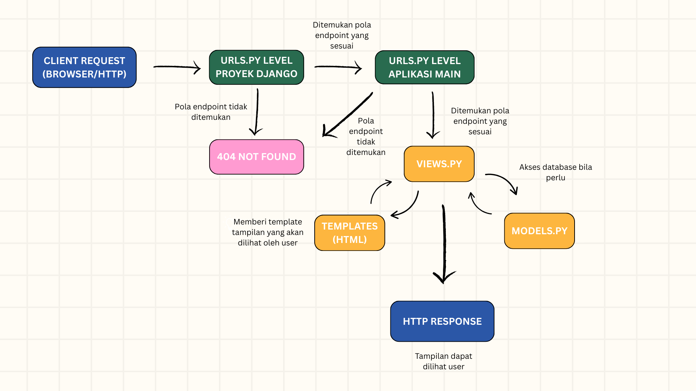

Nama : Azzahra Anjelika Borselano

NPM : 2406419663

Kelas : PBP B

Link aplikasi : https://azzahra-anjelika-kusepak.pbp.cs.ui.ac.id/

1. Jelaskan bagaimana cara kamu mengimplementasikan checklist di atas secara step-by-step (bukan hanya sekadar mengikuti tutorial).
    - Membuat direktori baru kemudian mengaktifkan virtual environment
    - Menginstall Django pada direktori tersebut
    - Membuat aplikasi 'main' kemudian masukkan di konfigurasi settings.py
    - Membuat file html dalam direktori baru bernama 'templates' untuk menampilkan nama aplikasi dan data diri
    - Membuat fungsi pada file views.py untuk menampilkan template html yang telah dibuat
    - Memanggil fungsi yang tadi didefinisikan pada views.py di dalam berkas urls.py supaya saat mengakses url aplikasi, ia akan menampilkan tulisan yang dibuat pada file html
    - Membuat model Products pada berkas models.py di dalam direktori aplikasi main. Menyesuaikan atribut dengan diminta pada soal
    - Membuat repository baru di Github, kemudian menjalankan git init pada direktori lokal untuk melakukan commit dan push
    - Membuat project baru di PWS kemudian meng-copy url aplikasi untuk dimasukkan ke dalam daftar Allowed Hosts di berkas settings.py
    - Commit dan push ke Github, kemudian push ke PWS
    - Menambahkan berkas README.md

2. Buatlah bagan yang berisi request client ke web aplikasi berbasis Django beserta responnya dan jelaskan pada bagan tersebut kaitan antara urls.py, views.py, models.py, dan berkas html.

3. Peran settings.py dalam proyek Django
settings.py berfungsi sebagai pusat konfigurasi proyek Django. Di dalamnya diatur koneksi database, daftar aplikasi yang digunakan, middleware, template, dan lain sebagainya. Singkatnya, file ini mengontrol bagaimana proyek Django berjalan pada berbagai lingkungan.

4. Cara kerja migrasi database di Django
Migrasi di Django adalah proses sinkronisasi perubahan model ke database. Tahapannya:
-- makemigrations membuat berkas migrasi berdasarkan perubahan pada models.py.
-- migrate mengeksekusi berkas migrasi tersebut ke database dan mencatat status migrasi.
Dengan demikian, struktur database selalu konsisten dengan definisi model.

5. Alasan Django dijadikan permulaan pembelajaran pengembangan perangkat lunak
Django dipilih karena menyediakan fitur yang lengkap, dokumentasi yang baik, serta arsitektur jelas (MTV). Django juga menekankan praktik keamanan dan kemudahan penggunaan Python, sehingga cocok untuk pemula memahami konsep dasar pengembangan perangkat lunak.